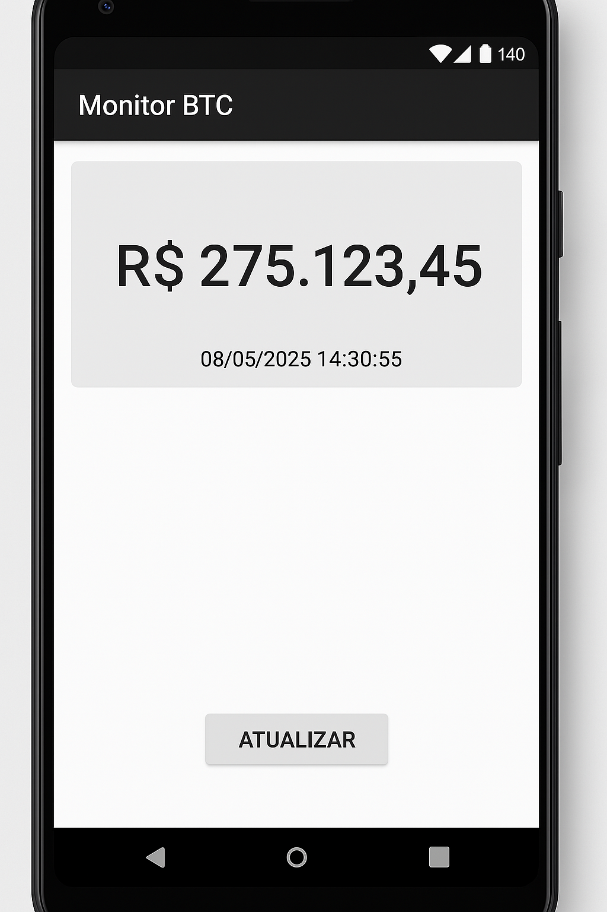
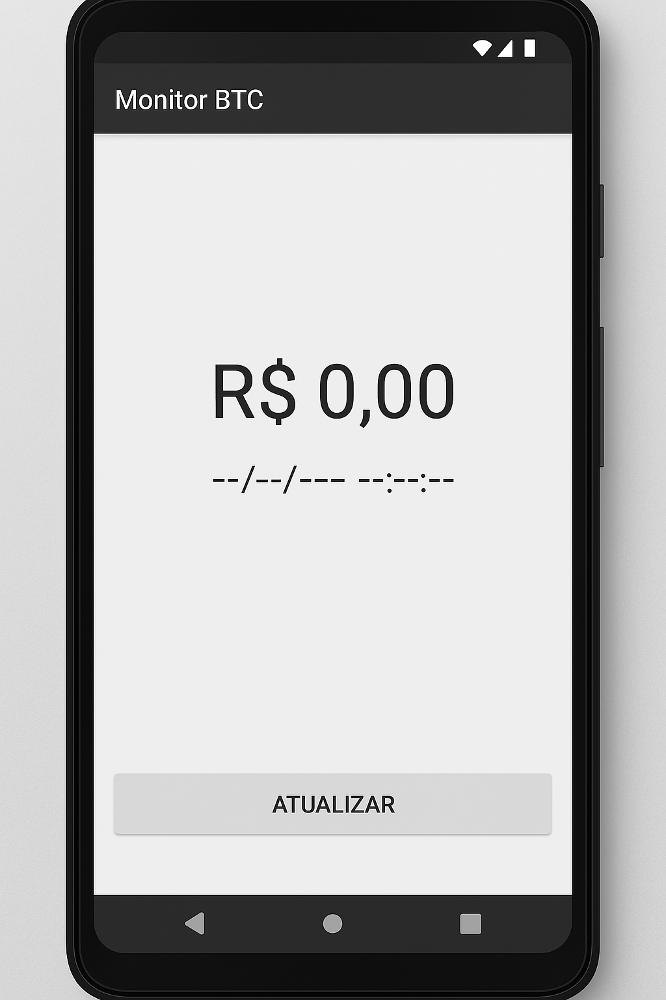

# Projeto Monitor de Criptomoedas em Android

## Aluno: [O SEU NOME AQUI]

## Matrícula: [SUA MATRÍCULA AQUI]

## Disciplina: [NOME DA DISCIPLINA]

## Professor: [NOME DO PROFESSOR]

## Introdução

Este projeto foi desenvolvido como parte da avaliação da disciplina de [NOME DA DISCIPLINA]. O objetivo principal é criar uma aplicação Android simples capaz de consultar e exibir a cotação de uma criptomoeda (Bitcoin - BTC) em Reais (BRL), utilizando a API pública do Mercado Bitcoin.

A ideia é que o utilizador possa, de forma rápida e fácil, verificar o valor atual do Bitcoin e a data da última atualização dessa cotação. A aplicação foi construída em Kotlin, seguindo as boas práticas de desenvolvimento Android, mas com um foco em ser um projeto de um aluno de Sistemas de Informação, ou seja, funcional e direto ao ponto!

## Funcionalidades

A aplicação possui as seguintes funcionalidades:

1.  **Visualização da Cotação:** Exibe o último valor de negociação do Bitcoin (BTC) em Reais (BRL).
2.  **Data da Cotação:** Mostra a data e hora em que a cotação exibida foi registada.
3.  **Botão de Atualização:** Permite que o utilizador solicite uma nova consulta à API para obter os dados mais recentes.
4.  **Interface Simples:** Uma interface limpa e intuitiva para facilitar a visualização das informações.

## Como Funciona

A aplicação, ao ser iniciada ou quando o botão "Atualizar" é pressionado, realiza uma chamada para a API do Mercado Bitcoin (`https://www.mercadobitcoin.com.br/api/BTC/ticker/`).

Os dados retornados pela API (em formato JSON) contêm várias informações sobre o Bitcoin, incluindo o último preço negociado (`last`) e a data dessa negociação (`date`).

A aplicação processa essa resposta, extrai os valores relevantes e atualiza os campos de texto na tela para mostrar ao utilizador.

Caso ocorra algum erro durante a comunicação com a API (por exemplo, falta de conexão com a internet ou a API estar temporariamente indisponível), uma mensagem de erro é exibida para o utilizador através de um `Toast`.

## Estrutura do Projeto

O projeto está organizado da seguinte forma:

*   **MainActivity.kt:** É a tela principal da aplicação, responsável por gerir a interface do utilizador, fazer as chamadas à API e exibir os dados.
*   **MercadoBitcoinService.kt e MercadoBitcoinServiceFactory.kt:** Classes responsáveis pela configuração e criação do cliente Retrofit para realizar as chamadas HTTP à API do Mercado Bitcoin.
*   **TickerResponse.kt e TickerData.kt:** Classes de dados (data classes) que modelam a resposta JSON da API, facilitando o processamento dos dados recebidos.
*   **Layouts (XML):**
    *   `activity_main.xml`: Define a estrutura geral da tela principal.
    *   `component_toolbar_main.xml`: Define a barra de ferramentas no topo da aplicação.
    *   `component_quote_information.xml`: Define a área onde a cotação e a data são exibidas, incluindo o botão de atualizar.
*   **Outros Recursos:** Inclui ficheiros de strings, cores, temas e ícones utilizados na aplicação.

## Telas da Aplicação

A seguir, são apresentadas algumas telas da aplicação para ilustrar o seu funcionamento.

### Tela com Valor (Cotação Carregada)

Esta tela mostra a aplicação após carregar com sucesso os dados da cotação do Bitcoin. É possível ver o valor em Reais e a data da última atualização.

*Descrição da Imagem: Tela da aplicação Android exibindo o título "Monitor BTC", um campo com o valor "R$ 53.434,10" e um campo de data "08/05/2025 23:20:00". Abaixo, um botão "ATUALIZAR".*

### Tela com Zero ou Sem Dados (Exemplo de Estado Inicial ou Erro)

Esta tela representa um estado onde a aplicação ainda não carregou dados, ou poderia ser um estado após um erro de carregamento (apesar de que, no caso de erro de API, um Toast é exibido). Para fins de demonstração, esta tela mostra os campos com valores zerados ou indicativos de ausência de dados.

*Descrição da Imagem: Tela da aplicação Android exibindo o título "Monitor BTC", um campo com o valor "R$ 0,00" e um campo de data "--/--/---- --:--:--". Abaixo, um botão "ATUALIZAR".*

## Como Compilar e Executar

1.  Clone este repositório.
2.  Abra o projeto no Android Studio.
3.  Aguarde o Gradle sincronizar e fazer o download das dependências.
4.  Execute a aplicação num emulador Android ou num dispositivo físico.

## Desafios e Aprendizados

Durante o desenvolvimento deste projeto, enfrentei alguns desafios, como:

*   Entender o funcionamento de chamadas assíncronas com Coroutines em Kotlin para não bloquear a interface principal.
*   Configurar o Retrofit para consumir a API REST do Mercado Bitcoin.
*   Formatar os dados (valor monetário e data) para uma apresentação amigável ao utilizador.

Este projeto foi uma ótima oportunidade para aplicar os conhecimentos adquiridos em desenvolvimento mobile Android, especialmente no que diz respeito ao consumo de APIs, manipulação de dados e criação de interfaces simples e funcionais.

## Próximos Passos (Sugestões)

Como sugestões para evoluções futuras, poderiam ser implementadas:

*   Suporte a outras criptomoedas.
*   Gráfico histórico de cotações.
*   Notificações de alteração de preço.
*   Melhorias na interface do utilizador.

---
*Este README foi gerado para fins académicos.*

